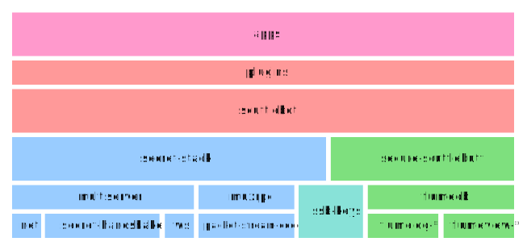

# SSB Stack

> A diagram detailing the core components utilized in [SSB](https://scuttlebutt.nz) applications.

(Pull requests: edit `scuttlebutt-stack.graphml` with [yEd](https://www.yworks.com/en/products/yfiles/yed/) or edit the SVG directly in code)

 This work is licensed under a <a rel="license" href="http://creativecommons.org/licenses/by-sa/4.0/">Creative Commons Attribution-ShareAlike 4.0 International License</a>.
